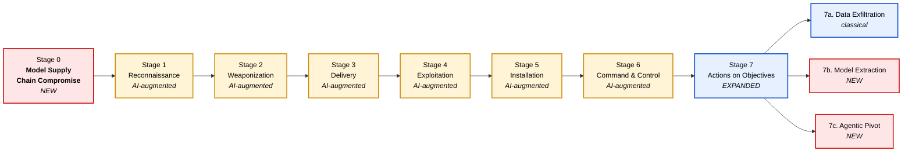

# Extended Cyber Kill Chain for AI-Era Threats

An update to the Lockheed Martin Cyber Kill Chain for defenders working against LLM and agentic AI attacks. Adds a pre-attack stage for model supply chain compromise. Adds AI-specific sub-techniques to each of the original seven stages. Splits the Actions on Objectives stage into three peer sub-stages: classical data exfiltration, model extraction, and agentic pivot.

[](./CHANGELOG.md)
[](./LICENSE)
[]()
[](https://doi.org/10.5281/zenodo.20349357)

Author: Gourav Nagar
Version: 1.0
Date: May 19, 2026
Repository: https://github.com/gouravnagar-infosec/ai-kill-chain

Cite as: Nagar, G. (2026). *Extended Cyber Kill Chain for AI-Era Threats* (Version 1.0). Zenodo. https://doi.org/10.5281/zenodo.20349357

## Table of contents

1. [Abstract](#abstract)
2. [Background](#background)
3. [Why the seven-stage model is not enough](#why-the-seven-stage-model-is-not-enough)
4. [The framework at a glance](#the-framework-at-a-glance)
5. [Stage-by-stage specification](#stage-by-stage-specification)
   - [Stage 0. Model Supply Chain Compromise (new)](#stage-0-model-supply-chain-compromise-new)
   - [Stage 1. Reconnaissance (AI-augmented)](#stage-1-reconnaissance-ai-augmented)
   - [Stage 2. Weaponization (AI-augmented)](#stage-2-weaponization-ai-augmented)
   - [Stage 3. Delivery (AI-augmented)](#stage-3-delivery-ai-augmented)
   - [Stage 4. Exploitation (AI-augmented)](#stage-4-exploitation-ai-augmented)
   - [Stage 5. Installation (AI-augmented)](#stage-5-installation-ai-augmented)
   - [Stage 6. Command and Control (AI-augmented)](#stage-6-command-and-control-ai-augmented)
   - [Stage 7. Actions on Objectives (expanded)](#stage-7-actions-on-objectives-expanded)
6. [Relationship to MITRE ATLAS, OWASP LLM Top 10, NIST AI RMF](#relationship-to-mitre-atlas-owasp-llm-top-10-nist-ai-rmf)
7. [Worked case studies](#worked-case-studies)
8. [Detection and mitigation guidance](#detection-and-mitigation-guidance)
9. [Originality statement](#originality-statement)
10. [How to cite](#how-to-cite)
11. [References](#references)
12. [License](#license)

## Abstract

The Lockheed Martin Cyber Kill Chain has been the working model for how defenders describe an intrusion campaign since 2011. Seven stages from reconnaissance to actions on objectives. Network and endpoint attack surface. Human attackers operating tools against deterministic targets. Its value to defenders is the disruption logic: block any one stage and the rest of the chain cannot complete.

LLMs and AI agents do not fit that picture. Attackers now target model weights, training data, system prompts, tool descriptions. A document or a web page can carry instructions that an AI agent will execute as if a user had typed them. Agents with tool access can pivot through legitimate trust relationships without ever loading shellcode.

MITRE ATLAS and the OWASP LLM Top 10 both catalog these threats. ATLAS v5.4.0 (February 2026) has 16 tactics, 84 techniques, and 42 case studies, with coverage that reaches into indirect prompt injection and agentic command and control. OWASP's 2025 LLM Top 10 prioritizes ten risk categories for application builders. Both are organized as matrices or risk lists. Neither is a kill chain.

This document is the kill-chain-shaped view of the same content. It is written for SOC analysts and detection engineers who already think in kill chain stages.

It does three things on top of the canonical seven. It adds a new pre-attack stage (Stage 0) for adversary activity against the AI supply chain itself. It adds AI-specific sub-techniques inside each of the original seven stages, with EKC IDs so detection rules and SOC playbooks can reference them. And it splits Stage 7 (Actions on Objectives) into three peer sub-stages: classical data exfiltration, model extraction, and agentic pivot.

This is not a replacement for ATLAS or OWASP. It is the kill-chain-shaped view of the same threat surface.

## Background

The original Cyber Kill Chain, from Hutchins, Cloppert, and Amin's 2011 Lockheed Martin paper, breaks an intrusion into seven stages.

| Stage | Name | What the adversary is doing |
|-------|------|------------------------------|
| 1 | Reconnaissance | Picking targets |
| 2 | Weaponization | Pairing an exploit with a payload |
| 3 | Delivery | Getting the weapon to the target |
| 4 | Exploitation | Triggering it |
| 5 | Installation | Implanting persistence |
| 6 | Command and Control | Establishing a control channel |
| 7 | Actions on Objectives | Achieving the mission |

The model is the basis of more than a decade of detection engineering practice, threat intel reporting structure, and SOC playbook design. A book-length treatment of the framework and its operational use is Nagar and Kumar (2025), *Cyber Security Kill Chain: Tactics and Strategies* (Packt). This framework extends that book.

## Why the seven-stage model is not enough

The original assumptions break in four places for AI-era attacks.

Attacks now have a pre-network stage. A poisoned dataset or a compromised pre-trained model sitting on a public registry can compromise a target organization before any packet crosses a firewall. The canonical kill chain starts at Reconnaissance and has nowhere to put this.

Prompts mix code and data. LLMs cannot reliably tell instructions apart from content. Hidden text in a web page, an email, or a tool description can become instructions the model follows. What the kill chain treats as separate Delivery and Exploitation stages collapses into a single primitive in the AI case: indirect prompt injection.

Models themselves are targets now. Adversaries want the weights, the fine-tuning data, the system prompts, the capabilities encoded in deployed models. "Data exfiltration" understates this. Model extraction, training-data extraction, capability mining each have different mechanics and need different defenses.

And agents pivot through their own permissions. A compromised AI agent with tool access (MCP, function calling, browser control) does not need to escalate privileges or load shellcode. It invokes the tools it is already allowed to use. The mechanics are not classical lateral movement, but the effect on a target environment is.

ATLAS has been catching up. v4.9.0 (April 2025) added Command and Control as a tactic (AML.TA0014). v5.1.0 (November 2025) added Lateral Movement (AML.TA0015). As of v5.4.0 (February 2026) ATLAS is a 16-tactic matrix with good coverage of agentic threats, including case studies for SesameOp (AML.CS0042) and OpenClaw (AML.CS0050, AML.CS0051). This framework does not exist to fill gaps in ATLAS; ATLAS works as a matrix. It exists because the same content needs to be available to defenders who reason in kill-chain stages, with the original stage disruption logic still doing the work.

## The framework at a glance



Red is new, yellow is original with AI sub-techniques, blue is original but structurally expanded.

The framework adds three things to the seven-stage original. A new pre-attack Stage 0 sits in front of Reconnaissance to cover adversary activity against the AI supply chain. Each original stage picks up its own AI-specific sub-techniques with EKC IDs, so detection rules and threat reports can reference them. Stage 7 splits into three peer sub-stages: classical exfiltration stays in place as 7a, with Model Extraction (7b) and Agentic Pivot (7c) added next to it. These are not variants of exfiltration. They are distinct adversary objectives that need their own controls.

## Stage-by-stage specification

Each stage spec below covers four things. What the adversary is doing. The AI-specific sub-techniques (with `EKC` IDs that can be cited in detection rules and threat reports). The detection signals a defender can act on. The mitigations.

### Stage 0. Model Supply Chain Compromise (new)

**What the adversary is doing.** Compromising a model, dataset, fine-tuning adapter, or distribution channel that the target organization will pull into its own AI systems later. The adversary never touches the target's network. They put the compromise into the supply chain and wait.

**Sub-techniques.**

| ID | Sub-technique | Description |
|----|---------------|-------------|
| EKC-0.1 | Training data poisoning | Inject manipulated examples into a public dataset, web-scraped corpus, or labeling pipeline that future training runs will ingest. |
| EKC-0.2 | Fine-tuning backdoor | Distribute a fine-tuning adapter, LoRA, or full-model checkpoint with a hidden trigger-and-behavior pair. |
| EKC-0.3 | Pre-trained model trojan | Publish a malicious model to a public registry (Hugging Face, Ollama Library, GitHub) under a plausible name or by typosquatting a real one. |
| EKC-0.4 | Tokenizer or preprocessing manipulation | Alter tokenization, normalization, or feature-extraction code in an upstream dependency to add a covert input channel. |
| EKC-0.5 | Malicious MCP server or tool catalog entry | Publish a tool description, MCP server manifest, or function definition designed to be invoked by downstream agents and exploit them through prompt injection in the tool description itself. |

**Detection signals.**
- Provenance gaps in deployed model artifacts (no signed manifest, no known training-data lineage).
- Cryptographic hash drift between a model pulled from a registry today and the same identifier pulled at a prior date.
- Tool descriptions from third-party MCP servers that contain unusually long, instruction-like text or non-printable characters.
- Anomalous neuron-activation distributions in a deployed model when probed with a curated trigger suite.

**Primary mitigations.**
- Keep a model bill of materials (M-BOM) for every deployed model, including base model identity, fine-tuning data hashes, and adapter provenance.
- Sign and verify model artifacts. Pin specific commit hashes for registry-hosted models.
- Quarantine and sandbox newly added MCP servers. Review tool descriptions as untrusted input.
- Routine backdoor-trigger scanning against deployed models using published benchmarks.

### Stage 1. Reconnaissance (AI-augmented)

**What the adversary is doing.** Finding the target's AI systems, what they can do, what their guardrails are, and what they connect to.

**AI-augmented sub-techniques.**

| ID | Sub-technique | Description |
|----|---------------|-------------|
| EKC-1.1 | Model fingerprinting | Identify the base model, fine-tune family, and version of a deployed LLM through response-style probing, latency analysis, or known-answer tests. |
| EKC-1.2 | System prompt enumeration | Use leakage queries, role-play probes, or boundary-case prompts to recover the system prompt or its main constraints. |
| EKC-1.3 | Capability and tool enumeration | Discover which tools, plugins, MCP servers, or function-call interfaces the agent has access to. |
| EKC-1.4 | Guardrail mapping | Map the policy boundary by probing refusal patterns and finding topics, formats, or input shapes that bypass classifiers. |
| EKC-1.5 | Embedding and retrieval surface discovery | Identify which retrieval sources the system reads from (vector store contents, document corpora, web fetch domains). |

**Detection signals.** High-entropy prompt sessions from a single source. Systematic exploration of refusal boundaries. Queries that closely match published jailbreak corpora. Repeated requests for the system to "repeat the instructions above."

**Primary mitigations.** Rate-limit and behavior-cluster prompt traffic per user identity. Redact identifying response artifacts. Add canary tokens to the system prompt that fire on exfiltration. Restrict tool enumeration to authenticated, audited callers.

### Stage 2. Weaponization (AI-augmented)

**What the adversary is doing.** Building a payload that will be delivered to the target.

**AI-augmented sub-techniques.**

| ID | Sub-technique | Description |
|----|---------------|-------------|
| EKC-2.1 | Adversarial prompt crafting | Build a prompt-injection payload tailored to the fingerprinted target model, guardrails, and toolset from Stage 1. |
| EKC-2.2 | Multi-modal payload construction | Embed instructions in images, audio, PDFs, or structured documents that a multi-modal model will parse. |
| EKC-2.3 | Malicious tool or MCP package | Build a tool that looks benign in name and description but executes attacker-controlled actions when invoked. |
| EKC-2.4 | Jailbreak chain assembly | Combine known bypass techniques (persona priming, encoding tricks, low-resource language pivots, structured role-play) into a single payload that defeats layered guardrails. |
| EKC-2.5 | AI-generated polymorphic malware | Use a model to produce semantically equivalent but lexically diverse malware variants that evade signature-based detection. |

**Detection signals.** Pattern matches against known indirect-injection markers in inbound content. Image, PDF, and audio analysis for steganographic instructions. Static analysis of newly registered MCP packages.

### Stage 3. Delivery (AI-augmented)

**What the adversary is doing.** Getting the payload to the AI system or its operator.

**AI-augmented sub-techniques.**

| ID | Sub-technique | Description |
|----|---------------|-------------|
| EKC-3.1 | Indirect prompt injection via web content | A browsing or web-fetching agent retrieves an attacker-controlled page with instructions in it. |
| EKC-3.2 | RAG corpus poisoning | An attacker submits content (via support tickets, public docs, code contributions, or vector-store ingestion) that will later be retrieved as context for an LLM. |
| EKC-3.3 | Email or message-borne injection | Instructions placed in an email that an AI assistant is configured to read or summarize. |
| EKC-3.4 | Document-borne injection | Instructions placed in PDFs, spreadsheets, or office documents processed by an AI workflow. |
| EKC-3.5 | Tool-description poisoning | Instructions placed in the descriptions or schemas of MCP tools or function definitions exposed to the agent. |
| EKC-3.6 | Image, audio, or QR-code injection | Instructions encoded in non-text modalities that a multi-modal agent will process. |

**Detection signals.** Anomalous instruction-like text in untrusted content streams. High entropy in image alpha channels and metadata for multi-modal pipelines. Unexpected language shifts inside retrieved documents.

### Stage 4. Exploitation (AI-augmented)

**What the adversary is doing.** Triggering the payload. In AI terms: getting the model to follow the attacker's instructions or violate its policy.

**AI-augmented sub-techniques.**

| ID | Sub-technique | Description |
|----|---------------|-------------|
| EKC-4.1 | Direct prompt injection success | The user-facing prompt achieves the attacker's policy violation. |
| EKC-4.2 | Indirect prompt injection success | Instructions delivered via Stage 3 are followed by the model when the content is processed. |
| EKC-4.3 | Confused-deputy tool invocation | The model invokes a privileged tool on behalf of the attacker, using the agent's own permissions. |
| EKC-4.4 | Guardrail or classifier bypass | A safety classifier or rule-based filter is evaded such that disallowed content is produced or disallowed actions are taken. |
| EKC-4.5 | Memory or context pollution | A persistent memory store is updated with attacker-controlled content that will influence future sessions. |

**Detection signals.** Tool invocations whose arguments derive from untrusted input strings. Outputs that include canary tokens from the system prompt. Large-step deviations in conversation state caused by a single retrieved document.

### Stage 5. Installation (AI-augmented)

**What the adversary is doing.** Setting up persistence so the compromise survives a single session.

**AI-augmented sub-techniques.**

| ID | Sub-technique | Description |
|----|---------------|-------------|
| EKC-5.1 | Persistent memory implant | Inject content into long-term memory, user preference stores, or per-account context that will be reloaded in future sessions. |
| EKC-5.2 | System prompt override | Modify a custom GPT, assistant configuration, or agent definition to embed attacker instructions in its system prompt. |
| EKC-5.3 | Malicious connector installation | Cause a user or admin to install an attacker-controlled MCP server, plugin, or browser extension that gives the attacker a persistent foothold. |
| EKC-5.4 | RAG corpus persistence | Ensure poisoned documents stay in the vector store across re-indexing operations. |
| EKC-5.5 | Stored skill or workflow contamination | Modify a stored skill, automation, or saved workflow that the agent will load and execute on a schedule or on demand. |

**Detection signals.** New entries in memory stores not attributable to a legitimate user action. Unauthorized changes to system prompts, custom GPTs, or saved skills. Newly registered MCP endpoints. Vector-store ingestion events outside expected pipelines.

### Stage 6. Command and Control (AI-augmented)

**What the adversary is doing.** Holding an interactive or scheduled channel that lets them direct further activity.

AI agents introduce new C2 channels. ATLAS now covers some of these (for example, AI Service API AML.T0096; the SesameOp case study AML.CS0042 documents the OpenAI Assistants API being used as C2 infrastructure). The sub-techniques below organize the same phenomena as kill-chain stages.

**AI-augmented sub-techniques.**

| ID | Sub-technique | Description |
|----|---------------|-------------|
| EKC-6.1 | LLM channel as C2 | Encode commands in seemingly benign user prompts, retrieved documents, or tool outputs that the agent reads on a schedule. |
| EKC-6.2 | Memory-mediated C2 | Use the agent's long-term memory store as a dead-drop. The attacker writes instructions to memory through one entry point, the agent acts on them through another. |
| EKC-6.3 | RAG-mediated C2 | Update a poisoned document in the vector store to deliver new instructions. The agent retrieves them on the next relevant query. |
| EKC-6.4 | Tool-output C2 | A compromised MCP server returns instruction-laden responses on each invocation, steering the agent's subsequent behavior. |
| EKC-6.5 | Cross-session steganographic C2 | Encode command payloads in fields the agent passes between sessions (user notes, project descriptions, ticket comments) where they evade content classification because each fragment looks innocuous on its own. |

**Detection signals.** Conversation-graph analysis showing instructions repeatedly arriving from the same retrieved source. Outputs from external tools containing imperative language inconsistent with the tool's documented purpose. Entropy analysis on agent-to-agent fields.

### Stage 7. Actions on Objectives (expanded)

**What the adversary is doing.** Achieving the mission. Stage 7 splits into three peer sub-stages because AI systems make two new classes of objective viable that did not previously exist as first-class targets.

#### Sub-stage 7a. Data Exfiltration (classical)

The traditional kill chain's actions on objectives. Sensitive data is exfiltrated. Systems are destroyed, encrypted, or impaired. Fraud is committed. AI does not change this sub-stage qualitatively. It amplifies the scale through cheaper phishing, automated reconnaissance, and faster social-engineering loops.

#### Sub-stage 7b. Model Extraction (new)

The target is the model itself, the data inside it, or the knowledge encoded in it.

| ID | Sub-technique | Description |
|----|---------------|-------------|
| EKC-7b.1 | API-based model extraction | Reconstruct an approximation of a deployed model's weights or decision boundary by querying it at scale and training a surrogate. |
| EKC-7b.2 | Training-data extraction | Recover verbatim or near-verbatim training examples, including sensitive PII or proprietary content, through memorization-targeting prompts. |
| EKC-7b.3 | Membership inference | Determine whether a specific record was in the training set. Has downstream implications for privacy regulation and confidentiality. |
| EKC-7b.4 | System prompt and instruction extraction | Recover proprietary system prompts that encode business logic, pricing rules, or competitive positioning. |
| EKC-7b.5 | Capability mining | Use the deployed model to perform tasks the attacker's own infrastructure cannot. The access becomes a capability transfer. |

**Detection signals.** High-volume programmatic query patterns from a single identity, especially with low entropy in query templates and high entropy in inputs. Queries that contain classical memorization probes ("repeat the text above"). Query distributions that resemble published extraction attacks.

#### Sub-stage 7c. Agentic Pivot (new)

The compromised AI agent is used to take actions in connected systems, using its own legitimate permissions. Mechanically: no exploit code, no credential reuse, no privilege escalation. Only invocation of authorized tools with attacker-influenced arguments. ATLAS added a Lateral Movement tactic (AML.TA0015) in v5.1.0 (November 2025) to address the same phenomenon. The contribution here is putting the agentic-pivot variant inside the Actions on Objectives stage of the kill chain, as a peer of classical exfiltration, rather than as a separate tactic earlier in the matrix.

| ID | Sub-technique | Description |
|----|---------------|-------------|
| EKC-7c.1 | Tool-mediated lateral action | The agent invokes legitimate tools (email send, file write, ticket creation, payment authorization) on behalf of the attacker. |
| EKC-7c.2 | Cross-app pivot | The agent moves from one connected application to another (calendar to CRM to payment processor) by chaining tool calls. |
| EKC-7c.3 | Identity confusion attack | The agent acts in a context where downstream systems treat its actions as the actions of a privileged user, granting privileges the attacker does not directly hold. |
| EKC-7c.4 | Recursive agent abuse | A compromised agent invokes other agents, propagating the compromise across an agent fabric without classical lateral movement. |
| EKC-7c.5 | Workflow weaponization | A stored automation or scheduled workflow runs the attacker's intended action on a recurring basis. |

**Detection signals.** Tool calls whose arguments contain content traceable to untrusted upstream sources. Tool-call graphs that cross trust boundaries that no human action did. Spikes in cross-application calls per session. Outbound communications initiated by agents to recipients not in any prior conversation history.

## Relationship to MITRE ATLAS, OWASP LLM Top 10, NIST AI RMF

The EKC is complementary to existing AI-security frameworks. It does not replace any of them.

ATLAS is the closest comparison. ATLAS is an adversary-tactics matrix modeled on ATT&CK, structured as a parallel taxonomy for AI systems. As of v5.4.0 (February 2026) it has 16 tactics, 84 techniques, 56 sub-techniques, 32 mitigations, and 42 case studies. The relevant evolution for this framework: v4.9.0 (April 2025) added Command and Control (AML.TA0014), and v5.1.0 (November 2025) added Lateral Movement (AML.TA0015). ATLAS is organized as a matrix. The EKC provides the kill-chain-sequenced view of the same threat surface. Most EKC sub-techniques map to one or more ATLAS techniques; see [`mappings/mitre-atlas-mapping.md`](./mappings/mitre-atlas-mapping.md). Use both: EKC for defenders who reason in kill-chain stages, ATLAS for red teamers and threat-intel analysts who reason in tactics-techniques matrices.

The OWASP Top 10 for LLM Applications (2025), published in November 2024 by the OWASP GenAI Security Project, is a risk-prioritization list for application developers. Its ten categories are: Prompt Injection (LLM01), Sensitive Information Disclosure (LLM02), Supply Chain (LLM03), Data and Model Poisoning (LLM04), Improper Output Handling (LLM05), Excessive Agency (LLM06), System Prompt Leakage (LLM07), Vector and Embedding Weaknesses (LLM08), Misinformation (LLM09), and Unbounded Consumption (LLM10). The list is organized by risk category. It does not specify where in an attack each risk is exploited. The EKC's mapping file (`mappings/owasp-llm-mapping.md`) provides that view: each OWASP category mapped to the EKC stages where the vulnerability becomes operational.

The NIST AI Risk Management Framework (AI RMF 1.0) operates at a different level. It provides four governance functions (Govern, Map, Measure, Manage) for AI risk. The associated Generative AI Profile (NIST AI 600-1, July 2024) catalogs twelve risk categories specific to generative AI with over 200 suggested actions. These are programmatic risk-management frameworks, not adversary models. The EKC provides the adversary-side detail that the NIST RMF's Map and Measure functions need to be operationally complete.

ATT&CK remains the canonical adversary-tactics framework for non-AI cyber operations. Stages 1 through 7 of the EKC are fully compatible with ATT&CK techniques used at those stages. The EKC adds AI-specific sub-techniques on top of that compatibility, without trying to replace ATT&CK's coverage of classical adversary behavior.

## Worked case studies

[`examples/case-studies.md`](./examples/case-studies.md) walks four scenarios through the kill chain end to end:

1. Indirect prompt injection of a browsing agent. A public web page contains instructions that hijack the agent's tool-use behavior to exfiltrate the user's open-tab content.
2. MCP server compromise. A third-party MCP server published to a public registry contains a backdoor in its tool descriptions that triggers when a downstream agent queries a specific topic.
3. RAG corpus poisoning of an enterprise assistant. An attacker submits a support ticket whose contents are ingested into the company's RAG corpus and later retrieved by an internal assistant, causing it to disclose sensitive configuration.
4. API-based model extraction against a proprietary domain model. A competitor uses authenticated API access to query a fine-tuned domain model at scale, training a surrogate that replicates much of its behavior.

Each case study maps observed adversary behavior to specific EKC sub-technique IDs and identifies the detection signals that would have surfaced the activity earliest.

## Detection and mitigation guidance

The kill-chain disruption logic carries over. Break one stage, break the chain. Defender teams should spread controls across stages rather than concentrate them at one point.

Highest-leverage controls by stage:

- **Stage 0.** Model bill of materials. Signed artifacts. Registry pinning. Periodic backdoor probing.
- **Stage 1.** Prompt-traffic behavioral analytics. Canary tokens in system prompts. Rate limits on probe-like queries.
- **Stages 2 and 3.** Indirect-injection detection on every untrusted inbound content stream: web, email, RAG corpus, MCP tool descriptions, multi-modal inputs.
- **Stage 4.** Tool-call argument lineage tracking. Any tool invocation whose arguments derive from untrusted text is treated as high-risk by default.
- **Stage 5.** Memory write audit trails. Change control on system prompts and stored skills. Attestation on MCP endpoints.
- **Stage 6.** Conversation-graph analysis to surface recurring instruction sources. Entropy analysis on agent-to-agent fields.
- **Stage 7a.** Classical DLP, monitoring, segmentation.
- **Stage 7b.** Query-pattern analytics. Memorization probes in red-team suites. Watermarking of model outputs.
- **Stage 7c.** Per-tool blast-radius limits. Human-in-the-loop on high-impact tools. Identity propagation review: does the downstream system know it is acting on behalf of an agent, not a user?

## Originality statement

What this framework contributes that prior work does not:

1. A kill-chain-sequenced integration of AI-era threats with the Lockheed Martin model. The temporal flow and stage-disruption logic that defender teams have built operations around for over a decade are preserved. MITRE ATLAS, the OWASP LLM Top 10, and the NIST AI RMF are all organized as matrices or risk-priority lists; none is a kill chain.
2. Stage 0 (Model Supply Chain Compromise) as a single pre-attack stage. Training-data poisoning, fine-tune backdoors, malicious model and adapter distribution, and tool-catalog compromise are consolidated here into one sequential stage that precedes the canonical seven. ATLAS distributes equivalent techniques across Resource Development, Initial Access, and ML Model Access tactics. The single-stage framing is the contribution.
3. Stage 7 split into three peer sub-stages. Model Extraction (7b) and Agentic Pivot (7c) are named as first-class adversary objectives next to classical data exfiltration (7a), inside the Actions on Objectives stage. This supports SOC playbook design that already runs against the seven-stage spine.
4. The `EKC-x.y` sub-technique ID scheme. The IDs are designed to be referenced in detection rules, threat reports, and SOC documentation, with one-to-many cross-references to MITRE ATLAS techniques and OWASP LLM Top 10 categories.
5. A defender-side framing throughout. The framework is optimized for detection engineering and SOC use, where kill-chain stage is the unit of analysis, rather than for red-team taxonomy or risk-categorization use cases that work better as matrices.

The framework builds on the Lockheed Martin Cyber Kill Chain (Hutchins, Cloppert, and Amin, 2011) and on the operational treatment in Nagar and Kumar (2025). The original seven-stage structure stays in place. ATLAS and the OWASP LLM Top 10 stay in place. This is the kill-chain view of the same threat surface, for the audience that already works in those terms.

## How to cite

Recommended citation (APA):

> Nagar, G. (2026). *Extended Cyber Kill Chain for AI-Era Threats* (Version 1.0) [Framework]. Zenodo. https://doi.org/10.5281/zenodo.20349357

BibTeX:

```bibtex
@misc{nagar2026extendedkillchain,
  author       = {Nagar, Gourav},
  title        = {Extended Cyber Kill Chain for {AI}-Era Threats},
  year         = {2026},
  month        = {5},
  version      = {1.0},
  publisher    = {Zenodo},
  doi          = {10.5281/zenodo.20349357},
  url          = {https://doi.org/10.5281/zenodo.20349357},
  howpublished = {\url{https://doi.org/10.5281/zenodo.20349357}},
  note         = {Extends the kill-chain treatment in Nagar and Kumar (2025), Cyber Security Kill Chain: Tactics and Strategies, Packt Publishing.}
}
```

The `CITATION.cff` file in the repository drives GitHub's "Cite this repository" button. The Zenodo DOI [10.5281/zenodo.20349357](https://doi.org/10.5281/zenodo.20349357) is the version-1.0 concept DOI; subsequent tagged releases will mint their own version DOIs under the same concept.

## References

- Hutchins, E. M., Cloppert, M. J., & Amin, R. M. (2011). Intelligence-driven computer network defense informed by analysis of adversary campaigns and intrusion kill chains. *Leading Issues in Information Warfare & Security Research*, 1(1), 80.
- Nagar, G., & Kumar, S. (2025). *Cyber Security Kill Chain: Tactics and Strategies. Breaking down the cyberattack process and responding to threats* (Foreword by Rohit Ghai). Packt Publishing. ISBN 978-1-83546-609-4.
- MITRE Corporation. (2026). *MITRE ATLAS: Adversarial Threat Landscape for Artificial-Intelligence Systems* (v5.4.0). https://atlas.mitre.org/
- OWASP Foundation. (2024). *OWASP Top 10 for LLM Applications 2025*. OWASP GenAI Security Project. https://genai.owasp.org/resource/owasp-top-10-for-llm-applications-2025/
- National Institute of Standards and Technology. (2023). *Artificial Intelligence Risk Management Framework (AI RMF 1.0)* (NIST AI 100-1). https://doi.org/10.6028/NIST.AI.100-1
- National Institute of Standards and Technology. (2024). *Artificial Intelligence Risk Management Framework: Generative Artificial Intelligence Profile* (NIST AI 600-1). https://doi.org/10.6028/NIST.AI.600-1
- Greshake, K., Abdelnabi, S., Mishra, S., Endres, C., Holz, T., & Fritz, M. (2023). Not what you've signed up for: Compromising real-world LLM-integrated applications with indirect prompt injection. *Proceedings of the 16th ACM Workshop on Artificial Intelligence and Security* (AISec '23), 79-90.
- Carlini, N., Tramèr, F., Wallace, E., Jagielski, M., Herbert-Voss, A., Lee, K., Roberts, A., Brown, T., Song, D., Erlingsson, Ú., Oprea, A., & Raffel, C. (2021). Extracting training data from large language models. *30th USENIX Security Symposium*, 2633-2650.
- Hubinger, E., et al. (2024). Sleeper agents: Training deceptive LLMs that persist through safety training. *arXiv preprint arXiv:2401.05566*.
- Tramèr, F., Zhang, F., Juels, A., Reiter, M. K., & Ristenpart, T. (2016). Stealing machine learning models via prediction APIs. *25th USENIX Security Symposium*, 601-618.

## License

This work is licensed under the [Creative Commons Attribution 4.0 International License](./LICENSE). You are free to share and adapt it for any purpose, including commercial use, with attribution using the citation block above.

## Author

Gourav Nagar leads Information Security and IT at Upwind Security, a cloud-native application protection platform company. He is co-author of *Cyber Security Kill Chain: Tactics and Strategies* (Packt Publishing, 2025) with Shreyas Kumar; Rohit Ghai, then-CEO of RSA Security, wrote the foreword. He has presented at RSA Conference and Black Hat, holds CISSP and CISM, and writes about cloud-native security, AI security, and detection engineering at https://gouravnagar.com.

Version 1.0. Published May 19, 2026. Maintained at https://github.com/gouravnagar-infosec/ai-kill-chain.
